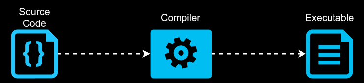

# Programming Languages

### What is a Programming Language?
A programming language is a tool—defined by its own formal set of instructions—used by humans to communicate with computers since computers cannot understand natural human speech, these languages provide a structured syntax and rules that translate our ideas into executable machine code, or binary

> 💡 Programming languages typically fall into two different classifications Low-Level & High-Level.
* Low-Level languages are those that are closer to machine code, or binary, like Assembly Language. Although they are difficult to write, they are extremely fast and give the programmer precise control over how the computer will function
* High-Level languages like Java, Python, and C++ are closer to how humans communicate by using words in their language that are close to the words we use in our daily life. This makes them easier to write and maintain, but they take longer to translate into machine code for the computer to understand

As modern computers have become more powerful, the difference in runtimes between High-Level and Low-Level languages is often just milliseconds, which means High-Level languages can be used in more scenarios. High and Low level programming languages each have their own philosophies, advantages, and use cases, but at the end of the day, all programming languages are just different ways of telling computers what to do. 

Programming languages are tools and deciding which one to use is similar to how you choose any other tool for the job at hand. If you're just starting out in the world of programming, it may be difficult to choose which one to use, so I recommend choosing one language and sticking with it. Eventually you'll be able to learn other languages much easier and as you continue to add these tools to your toolbelt, then it will become clearer which tool can be best leveraged for your situation.

### Compiled vs Interpreted Languages

Compiled langugaes are languages that need to be translated into a lower level language, typically macine code, in order to be read and executed by the computer.

