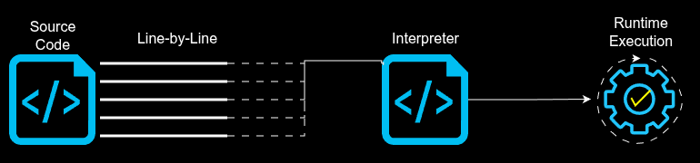

# Programming Languages

### What is a Programming Language?
A programming language is a tool—defined by its own formal set of instructions—used by humans to communicate with computers since computers cannot understand natural human speech, these languages provide a structured syntax and rules that translate our ideas into executable machine code, or binary

> 💡 Programming languages typically fall into two different classifications Low-Level & High-Level.
* Low-Level languages are those that are closer to machine code, or binary, like Assembly Language. Although they are difficult to write, they are extremely fast and give the programmer precise control over how the computer will function
* High-Level languages like Java, Python, and C++ are closer to how humans communicate by using words in their language that are close to the words we use in our daily life. This makes them easier to write and maintain, but they take longer to translate into machine code for the computer to understand

As modern computers have become more powerful, the difference in runtimes between High-Level and Low-Level languages is often just milliseconds, which means High-Level languages can be used in more scenarios. High and Low level programming languages each have their own philosophies, advantages, and use cases, but at the end of the day, all programming languages are just different ways of telling computers what to do. 

Programming languages are tools and deciding which one to use is similar to how you choose any other tool for the job at hand. If you're just starting out in the world of programming, it may be difficult to choose which one to use, so I recommend choosing one language and sticking with it. Eventually you'll be able to learn other languages much easier and as you continue to add these tools to your toolbelt, then it will become clearer which tool can be best leveraged for your situation.

## ⚙️ Compiled vs Interpreted Languages

Compiled langugaes are languages that need to be translated into a lower level language, typically macine code, in order to be read and executed by the computer.

Interpreted languages are translated by a program called an interpreter line-by-line. These languages are slower than compiled languages because they are actively translating each line of code, executing that line of code, then retrieving the next line of code, and repeating the process.

### 🟢 Pros & Cons 🔴

### Compiled Language
| Pros | Cons |
|:----:|:----:|
|High Performance|Longer Development Cycle|
|Better Optimization|Platform-Specific Builds|
|Stronger Type Checking|More Complex Toolchains|
|Executable Distribution|Harder Debugging in some cases|
|Improved Security of Source Code|Less Flexibility at Runtime|

Code is translated directly into machine code before execution in a compiled language, which offers many advantages over an interpreted language. They're usually more performant because the compiler can optimize for speed, memory usage, and hardware architecture. Distribution and Security of the code is also better with compiled languages since user's typically receive a standalone binary executable instead of the source code. General use cases for compiled languages are systems programming, embedded systems, game engines, and performance-critical software.

However, there are some downsides, namely the development time is much longer because compilation is required before testing your changes. Additionally, optimized binaries may be harder to debug than interpreted code, plus managing dependencies, linkers, and build systems along the toolchains can be difficult. When compiling the binaries, they're often built specifically for that platform and require separate compilation for different operating systems or CPU architectures for distribution. 

### Interpreted Language
| Pros | Cons |
|:----:|:----:|
|Faster Development|Slower Execution|
|Easier Debugging|Higher Runtime Resource Usage|
|Dynamic Features|Runtime Errors|
|Greater Portability|Requires Interpreter Installation|
|Simpler Learning Curve|Source Code Exposure|

The source code can often be run immediately leading to faster development time, and the same source code can run anywhere the interpreter exists, so distribution is simpler. Interpreted languages are often more beginner-friendly with less setup required and errors are typically easier to inspect during execution. They also offer dynamic features like easier runtime introspection, scripting, metaprogramming, and dynamic typing. These languages are commonly used for rapid prototyping, tooling, and scripting and automation tasks.

But of course there's downsides, like slower execution due to the overhead of interpreting code during runtime, and the interpreter itself consuming additional memory and CPU resources. In terms of code exposure, the programs are often distributed as readable source files and end users need to have the language interpreter installed. Real-time systems may suffer from performance limitations.

>❗**IMPORTANT**: The distinction between Compiled & Interpreted Languages is no longer perfectly black and white, modern languages blur the line

### Blurring the Line

* Java compiles to bytecode that runs on the JVM (Java Virtual Machine)—an engine that drives the execution of Java code
* C# compiles to Intermediate Language (IL) for the CLR (Common Language Runtime)—the virtual machine and execution engine for all .NET applications
* JavaScript engines like V8 use JIT(Just-In-Time) compilation internally
* Python compiles to bytecode before interpretation in CPython

So in practice, many modern languages combine aspects of both compiled and interpreted execution models.

---

> ⚠️ Keep in mind this repository is not meant to supplement an actual programming course. This is simply a collection of information that can be used as reference material or a study aide. It's up to you to learn your programming language of choice.

Check the following links for more information including code snippets and templates for a given language:

* [Java](java/java.md)
* [Python](python/python.md)
