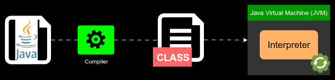
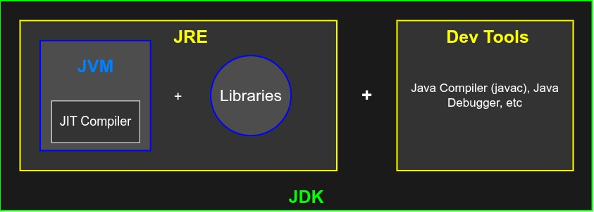

# Java

Java was originally designed in 1991 by James Gosling at Sun Microsystems for interactive television and dubbed "Oak". The project was later renamed "Java" after Java coffee in 1995, and was officially annouced and released to the public.

Java revolutionized the tech world in 1996 with its "Write Once, Run Anywhere" philosophy and JVM architecture. Over the years the language was maturing rapidly, Sun then releases Java 2 and eventually opens up the core code, making it free and open-source under the GNU General Public License. 

In 2010, Oracle Corporation acquired Sun Microsystems and took over the stewardship of Java. In 2014, Java 8 was released introducing lambda expressions and a major overhaul to how developers write functional code. Now, major versions are published on a strict 6-month feature release cycle and Java remains a core language powering enterprise servers, cloud applications, and Android mobile apps.

## Write Once, Run Anywhere

Java can be considered both a compiled and interpreted language. Instead of translating source code directly into machine code (like C++), Java uses a two-step process to achieve platform independence, which allows for the Write Once, Run Anywhere philosophy.

1. Compilation: The Java compiler (`javac`) converts source code(`.java` files) into an intermediate format called bytecode(`.class` files)
2. Interpretation: The **Java Virtual Machine (JVM)** reads this bytecode and translates it into machine-specific instructions at runtime

### Performance Optimization: JIT Compilation

While the JVM statrts by interpreting bytecode line-by-line, it useds a **Just-In-Time (JIT)** compiler for efficiency
* The JIT monitors the code as it runs
* When it identifies "hot spots" (frequently used code sections), it compiles that bytecode directly into native machine code
* This allows the code to run nearly as fast as purely compiled languages

In order for Java code to run on a computer, the host machine must have the **Java Runtime Environment (JRE)** installed, which most modern devices do have installed by default

## Get Developing in Java

While most modern machines already have the **Java Runtime Environment** (JRE) installed, in order to start coding in Java we need to install the JDK, or **Java Development Kit**.

You have two main options when it comes to choosing which JDK to install, and that's the OpenJDK—a free and open-source project maintained by Oracle and Red Hat with open-source community contributions—or the official proprietary version of Java, maintained and distributed by Oracle. You can check out [this article](https://tuxcare.com/blog/openjdk-vs-oracle-jdk/) to help you decide.

Once the JDK is installed, further setup is slightly different depending on the platform you're using, but in general you'll need to add the location of your JDK's bin folder to your PATH variable. Use Google for more detailed instructions on getting setup for your specific platform.

### Useful Code Snippets & Templates

* [Snippets](snippets.md)
* [Templates](templates/README.md)

[Home](/README.md)
